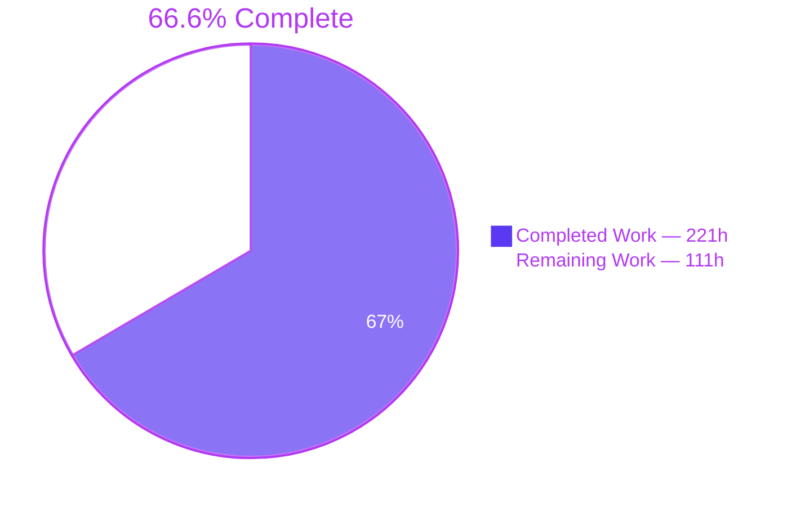
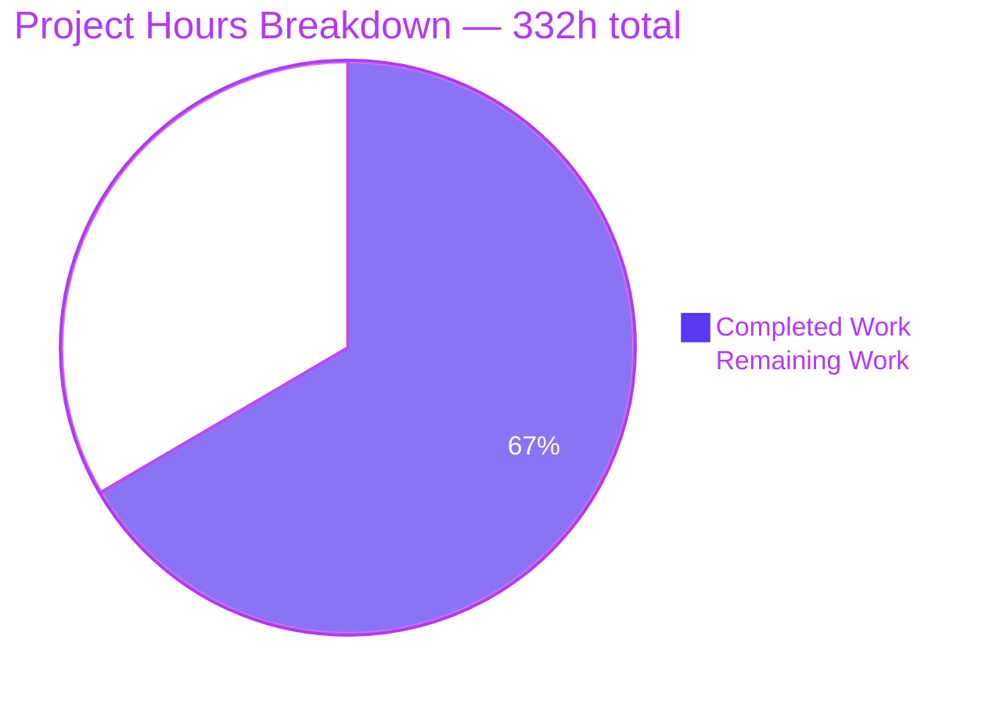
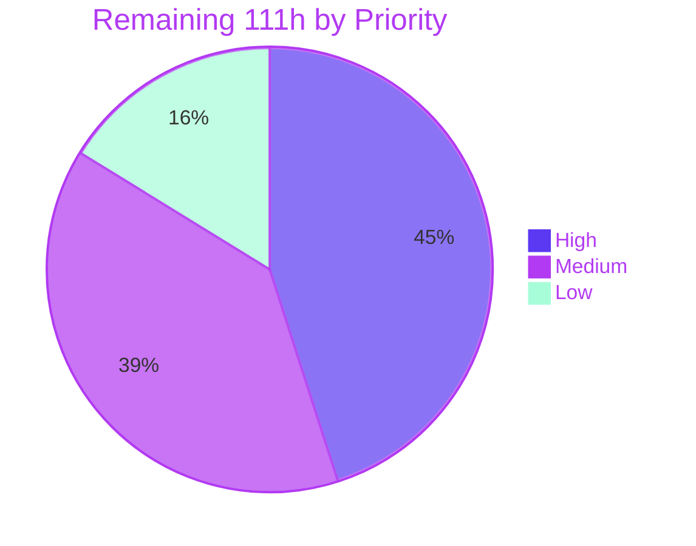

# Blitzy Project Guide
### Five-Layer Read-Only Security Assessment — Cal.com-Derived TypeScript Monorepo

<table>
<tr><td><b>Branch</b></td><td><code>blitzy-127b8d2b-5cbb-41c7-9352-1e7429cc589a</code></td></tr>
<tr><td><b>Base commit</b></td><td><code>e988138b24</code></td></tr>
<tr><td><b>Commits</b></td><td>21, all authored by <code>Blitzy Agent &lt;agent@blitzy.com&gt;</code></td></tr>
<tr><td><b>Tracked diff</b></td><td><code>M .gitignore</code> (+3 lines) — nothing else</td></tr>
<tr><td><b>Artifacts produced</b></td><td>23 files under <code>security-audit/</code></td></tr>
<tr><td><b>Gate verdict</b></td><td><code>BLOCK</code> — 16 gate-blocking findings</td></tr>
<tr><td><b>Verification</b></td><td>16 / 16 checks PASS, exit 0</td></tr>
</table>

---

## 1. Executive Summary

### 1.1 Project Overview

This project delivers a five-layer, read-only security assessment of a Cal.com-derived TypeScript monorepo (7,434 source files, 123 workspaces, four runtime surfaces) and emits a deterministic, machine-verifiable artifact set that a CI/CD pipeline can consume as a merge gate. The consumers are the application-security, platform and DevOps teams who must know where the codebase is exploitable and which findings should block a release. Layers span architectural reasoning, pattern SAST, exhaustive sink/mitigation inventory, exploitability triage and software-composition analysis. The deliverable is **evidence, not repair**: no vulnerability is fixed, no dependency upgraded, and zero application source files are modified. Business impact is a defensible, reproducible security posture with an actionable gate verdict.

### 1.2 Completion Status



> **Center label: 66.6% Complete** &nbsp;•&nbsp; <span style="color:#5B39F3">■</span> Completed = Dark Blue `#5B39F3` &nbsp;•&nbsp; <span style="color:#FFFFFF">□</span> Remaining = White `#FFFFFF`

| Metric | Value |
|---|---|
| **Total Hours** | **332** |
| **Completed Hours (AI + Manual)** | **221** (221 AI + 0 Manual) |
| **Remaining Hours** | **111** |
| **Percent Complete** | **66.6%** |

**Calculation shown explicitly (PA1 methodology, AAP-scoped work only):**

```
Completed Hours = 221   (all 11 AAP directives D0–D10 delivered and verified,
                         plus cross-cutting AAP obligations: provenance, containment,
                         4 rounds of QA remediation, and the final validation pass)
Remaining Hours = 111   (0 AAP directive gaps; 13 path-to-production items:
                         finding disposition, CI gate wiring, runner provisioning,
                         artifact publication, baseline activation, coverage deepening)
Total Hours     = 221 + 111 = 332
Completion %    = 221 / 332 × 100 = 66.6%
```

**Requirement classification:** 11 of 11 directives **Completed** · 0 Partially Completed · 0 Not Started. All 15 implicit requirements, 10 ambiguity resolutions and 10 enterprise practices satisfied with measured evidence.

### 1.3 Key Accomplishments

- [x] **All 11 directives (D0–D10) completed and independently verified** — the full five-layer pipeline plus normalization, merge, gate and verification tail
- [x] **Layer 0** — `codebase-profile.txt` with all 7 mandated fields populated; TypeScript confirmed at 99.5% of source; 23-entry exclude set frozen so no fragile category can silently zero
- [x] **Layer 1** — **126 architectural findings** spanning all 10 mandated categories across 209 files, each with a most-specific CWE and a full entry-point-to-impact narrative
- [x] **Layer 2** — 3 rule packs pinned to disk (2,011,507 bytes, 837 authored stanzas → 725 loaded, delta disclosed honestly); a valid SARIF 2.1.0 log with **463 findings**; all 725 driver rules carry the host-independent `security-audit.rules.` prefix
- [x] **Layer 3a** — **14,865 inventory rows**, 100% format-valid, covering **all 19 sink and all 9 mitigation categories**, with test code routed to separate partitions
- [x] **Layer 3b** — **40 taint findings across all 19 categories**, **16 gate-blocking / 24 advisory**, every advisory carrying a reviewer-verifiable `demotionReason`, and **zero fabricated findings**
- [x] **Layer 4** — 122 packages and 371 raw advisories deduplicated to **260 findings**, each carrying the version-override caveat
- [x] **Merged report** — 889 findings → 880 unique with **9 genuine cross-layer corroborations** (including the plan's own named CWE-250 container-`USER` pair) and `gate_verdict: BLOCK`
- [x] **Verification harness** — a 2,361-line, dependency-free suite implementing all 16 checks, **generated *and* executed**: 16/16 PASS at exit 0, with a byte-identical capture
- [x] **Adversarially hardened** — 26 negative controls, 416 check lines, **zero empty-reason failures**; an escape byte injected into `verify.sh` itself is caught by its own check 12
- [x] **Byte-for-byte reproducibility proven** for all four deterministic layers (0, 2, 3a, 4)
- [x] **Read-only guarantee held absolutely** — 0 application source files modified; the entire tracked diff is `M .gitignore` (+3 lines)
- [x] **4 real in-scope defects found and fixed** during autonomous validation, each re-verified to a proven fixpoint

### 1.4 Critical Unresolved Issues

| Issue | Impact | Owner | ETA |
|---|---|---|---|
| **Gate verdict is `BLOCK`** — 16 gate-blocking Layer 3b findings (5 critical / 10 high / 1 medium); 13 in `apps/api/v2`, 3 in `packages/features/webhooks` | Any pipeline adopting this gate cannot merge until each finding is accepted, waived with justification, or scheduled | Application Security | 20h |
| **10 critical dependency advisories**, incl. a 9.3 CWE-185 on `fast-xml-parser` that the repository's own audit suppression does not cover and whose `resolutions` pin does not remediate | The existing CI gate is the Yarn auditor that this very suppression silences for that package | Platform / Dependencies | 12h |
| **126 architectural findings undispositioned** (14 critical / 36 high) — key reuse, three fail-open rate-limiter returns, wildcard `postMessage` targets, unanchored origin matcher, non-constant-time secret comparisons | Highest-value class; pattern SAST structurally cannot reach these | Application Security | 18h |
| **No CI wiring** — the harness is produced and proven, but nothing invokes it (the plan explicitly excludes enforcement rollout) | The gate has no effect until a workflow consumes `_summary.gate_verdict` | DevOps | 10h |
| **`WARN` branch inert** — `baseline.json` declares `first_run: true`, so drift detection is unreachable by design until a second run publishes a comparable baseline | No regression detection between runs yet | DevOps | 4h |
| **Artifacts are git-ignored by design** with no persistence outside the working tree | Each run's evidence is lost unless a CI job publishes it | DevOps | 4h |
| **Proxy mount-order finding awaits runtime confirmation** — `apps/api/index.js` mounts v1 at root before v2, so `/v2/*` is expected to bypass v2's 23-guard chain | Reported as high-confidence architectural with the confirmation requirement stated in the finding itself | API Platform | 4h |
| **48 pre-existing TypeScript errors** in 17 tracked application files break `turbo run type-check` via `@calcom/trpc#build` | Pre-existing and byte-identical to base; repair is forbidden by the zero-source-modification requirement | Core Engineering | Separate backlog |

### 1.5 Access Issues

**No access issues identified.** Every resource the assessment required was reachable, and this was validated against live permissions during review.

| System / Resource | Type of Access | Issue Description | Resolution Status | Owner |
|---|---|---|---|---|
| Git repository (`blitzy-…589a` checkout) | Read + write to branch | None — 21 commits landed; working tree clean | ✅ No issue | Blitzy Agent |
| `semgrep.dev` rule registry | HTTPS egress | None — all 3 packs fetched and cached (2,011,507 bytes) | ✅ No issue | Blitzy Agent |
| OSV vulnerability database | HTTPS egress | None — 122 packages / 371 advisories retrieved | ✅ No issue | Blitzy Agent |
| PostgreSQL fixture (`calcom-postgres`:5432) | Database read | None — healthy, migrated and seeded; 52 users verified live | ✅ No issue | Blitzy Agent |
| Redis fixture (`calcom-redis`:6379) | Service | None — up and reachable | ✅ No issue | Blitzy Agent |
| Seeded application account (`pro@example.com`) | Authentication | None — end-to-end login succeeded against the live database | ✅ No issue | Blitzy Agent |
| Cal.com live/deployed infrastructure | Network scanning | **Deliberately not accessed** — the repository's own disclosure policy prohibits running automated scanners against its infrastructure | ✅ Honoured by design | N/A |
| Locked-down CI runner egress *(forward-looking)* | HTTPS egress allowlist | Not a present blocker; a restricted runner will need `semgrep.dev` and the OSV database allowlisted, or the cached packs plus offline-DB flags | ⚠️ Future provisioning | DevOps |
| Code-scanning SARIF ingestion *(forward-looking)* | Publish permission | Not a present blocker; publishing `results-semgrep.sarif` will require the relevant upload scope | ⚠️ Future provisioning | DevOps |

### 1.6 Recommended Next Steps

1. **[High]** Disposition the **16 gate-blocking findings**, then re-run `bash security-audit/verify.sh security-audit` and the gate to confirm the verdict transition away from `BLOCK`. Start with the 5 critical and the 3 CWE-918 webhook SSRF findings. *(20h)*
2. **[High]** Settle the dependency posture: the 10 critical advisories, the 65 override-shadowed records, and the `fast-xml-parser` suppression boundary — then decide whether OSV replaces or supplements `yarn npm audit --severity critical`. *(12h)*
3. **[High]** Disposition the **126 Layer 1 architectural findings**, beginning with the 14 critical. This is the class pattern SAST cannot reach, so it carries the highest marginal value. *(18h)*
4. **[Medium]** Wire the pipeline and gate into CI with the three load-bearing invariants enforced — repository-root working directory, **relative** rules config path, and `osv-scanner` exit 1 treated as success — and provision the runner with pinned tool versions. *(16h combined)*
5. **[Medium]** Publish the artifacts, seed the baseline with a second run to activate the `WARN` branch, and ingest the SARIF into a code-scanning surface. *(11h combined)*

---

## 2. Project Hours Breakdown

### 2.1 Completed Work Detail

| Component | Hours | Description |
|---|---:|---|
| **D0** — Layer 0 Codebase Discovery | 6 | `codebase-profile.txt` (26,888 B / 398 lines) with all 7 mandated fields; TypeScript identified at 7,396 of 7,434 files (99.5%); 23-entry exclude set derived from the repository's own ignore rules and frozen; test-file predicates reconciled to the repository's real conventions |
| **D1** — Layer 1 Architectural Security Audit | 38 | **126 findings** across all 10 mandated categories, 209 files examined, each finding tracing entry point to impact with a most-specific CWE; per-category coverage record persisted to `coverage-layer-1.txt` in the exact mandated format |
| **D2** — Semgrep install + rule-pack pinning | 5 | 3 packs cached to disk (2,011,507 B; 837 authored stanzas → 725 loaded, delta disclosed); **both published Directive 2 commands proven non-existent and replaced with verified forms**; config validates at exit 0 with 0 errors |
| **D3** — Layer 2 scan + normalization | 12 | `results-semgrep.sarif` (1,785,873 B, valid SARIF 2.1.0, 463 results, 725 driver rules) + `results-semgrep.json` enrichment; driver-level severity join built because `result.level` is absent on 100% of results; **463 normalized findings** |
| **D4** — Layer 3a Sink & Mitigation Inventory | 16 | **14,865 rows** across 28 pattern categories, 100% format-valid; 19/19 sink and 9/9 mitigation categories non-empty; pattern augmentation proven materially necessary (cookie 0→42 rows, XXE 2→5); deterministic sort key validated byte-identical |
| **D5** — Layer 3b Taint Analysis & gate triage | 30 | **40 findings across all 19 categories**, 2,300 sinks evaluated against 4,164 mitigations; gate-blocking truth table applied → 16 blocking / 24 advisory; every advisory carries a reviewer-verifiable `demotionReason`; **zero fabricated findings**; every record anchored to an inventory line |
| **D6** — Layer 4 OSV-Scanner + normalization | 10 | `results-osv.json` (2,846,875 B) over the single `yarn.lock`; 122 packages / 371 raw advisories → **260 findings** after `(package, CVE)` deduplication; CVSS band mapping, path relativization, and the 41-`resolutions` override caveat on every record |
| **D7** — Cross-layer normalization | 9 | All 889 findings normalized to the two mandated schemas as single-line minified JSON; measured result: 0 empty descriptions, max length exactly 200, 0 non-integer `line`, 0 out-of-vocabulary severities, 0 escape bytes |
| **D8** — Cross-layer merged report | 10 | `findings-merged.json` (509,036 B): `_summary` header then 880 body records; inter-layer-only deduplication (889→880) avoiding the 256→79 collapse with 43 fabricated corroborations; **9 genuine corroborations**; 7 explicit disclosures published |
| **D9** — CI/CD gate decision function | 7 | `gate_verdict: BLOCK` computed in strict `ERROR > BLOCK > WARN > PASS` precedence and independently recomputable; 16 gate-blocking findings enumerated with file, line, CWE and one-sentence exploit; `baseline.json` persisted as the drift anchor |
| **D10** — Verification harness | 22 | `verify.sh` — **2,361 lines** of dependency-free Bash with inline Python implementing all 16 checks, never an empty reason, exiting with the failure count; **generated *and* executed**: 16/16 PASS, exit 0, byte-identical capture |
| Provenance & run metadata | 12 | `run-metadata.txt` — 15,416 lines across 31 sections: exact tool versions, acquisition provenance, exit codes with their meaning, durations, counts, digest attestation tables, and every deviation and limitation encountered |
| Artifact containment & read-only enforcement | 6 | `security-audit/` artifact root designated; incremental status ledger written as each layer completed; read-only guarantee enforced and verified before and after every phase; the single `.gitignore` update |
| Autonomous QA remediation (4 review rounds) | 16 | 16 code-review findings resolved, provenance QA closed, an order-3 review round closed, and write-surface containment restored — traceable across the 21-commit arc |
| Final autonomous validation pass | 22 | 5 production-readiness gates; 8,155 tests across 5 suites; byte-level determinism reproduction of all 4 deterministic layers; browser runtime validation with end-to-end authentication; 26 adversarial negative controls; **4 real in-scope defects found and fixed to a proven fixpoint** |
| **TOTAL COMPLETED** | **221** | *Matches Completed Hours in Section 1.2* |

### 2.2 Remaining Work Detail

| Category | Hours | Priority |
|---|---:|---|
| Gate-blocking finding disposition — 16 Layer 3b findings (5 critical / 10 high / 1 medium) across CWE-522/532/601/639/807/843/862/918 | 20 | High |
| Layer 1 architectural finding disposition — 126 findings (14 critical / 36 high / 67 medium / 9 low) | 18 | High |
| Dependency advisory disposition — 260 records over 76 packages, 10 critical, 65 override-shadowed, plus the `fast-xml-parser` suppression-boundary decision | 12 | High |
| Layer 2 SAST finding disposition — 463 records, with severity de-inflation per the published disclosure and secret-scanner false-positive screening | 12 | Medium |
| CI/CD gate workflow authoring, wiring and dry-run | 10 | Medium |
| CI runner provisioning — pinned tool versions plus egress allowlist or offline vulnerability database | 6 | Medium |
| Artifact retention, publication and access model (artifacts are git-ignored by design) | 4 | Medium |
| Baseline seeding + second run to activate the `WARN` branch and verify drift | 4 | Medium |
| SARIF ingestion into a code-scanning surface | 3 | Medium |
| Runtime confirmation of the proxy mount-order finding (declared Open Risk) | 4 | Medium |
| Layer 3b coverage deepening beyond the mandated 200-sink budget (8 capped categories; 2,300 of 8,067 sinks evaluated) | 12 | Low |
| Scheduled re-run cadence, ownership and rotation | 2 | Low |
| Stakeholder review, report walkthrough and disclosure handling | 4 | Low |
| **TOTAL REMAINING** | **111** | *High 50 · Medium 43 · Low 18* |

### 2.3 Reconciliation

| Check | Expected | Actual | Status |
|---|---|---|---|
| Section 2.1 total | 221 | 221 (15 rows) | ✅ |
| Section 2.2 total | 111 | 111 (13 rows) | ✅ |
| Section 2.1 + Section 2.2 | 332 | 332 | ✅ |
| Section 1.2 Total Hours | 332 | 332 | ✅ |
| Section 1.2 Remaining = Section 2.2 sum = Section 7 pie "Remaining Work" | 111 | 111 / 111 / 111 | ✅ |
| Completion % (221 / 332 × 100) | 66.6% | 66.6% | ✅ |
| Priority bands sum to Section 2.2 total | 50 + 43 + 18 = 111 | 111 | ✅ |
| AAP directives with outstanding hours | 0 | 0 | ✅ |

---

## 3. Test Results

All figures below originate exclusively from Blitzy's autonomous validation logs for this project. The verification harness and the artifact-validation sweep were additionally **re-executed during this review**, reproducing the recorded results exactly.

| Test Category | Framework | Total Tests | Passed | Failed | Coverage % | Notes |
|---|---:|---:|---:|---:|---:|---|
| Unit (repository default suite) | Vitest 4.0.16 | 7,369 | 7,369 | 0 | n/a — no coverage threshold is configured anywhere in the repository | 627 files passed / 7 skipped; `success: true`, `numFailedTests: 0`, `numFailedTestSuites: 0` |
| Integration | Vitest 4.0.16 (`VITEST_MODE=integration`) | 463 | 463 | 0 | n/a | 46 files passed / 1 skipped; runs against the live seeded PostgreSQL fixture |
| Packaged embed | Vitest 4.0.16 (`VITEST_MODE=packaged-embed`) | 1 | 1 | 0 | n/a | 1 file passed |
| Timezone | Vitest 4.0.16 (`VITEST_MODE=timezone`, `TZ=UTC`) | 70 | 70 | 0 | n/a | 4 files passed |
| API v2 unit (NestJS) | Jest | 252 | 252 | 0 | n/a | 18 / 18 suites passed |
| **Directive 10 verification suite** | Bash + inline Python (`verify.sh`, 2,361 lines) | **16** | **16** | **0** | 100% of mandated checks | Exit 0; capture byte-identical to `verify-output.txt` (sha256 `9c02975e…`); **re-executed during review with identical result** |
| Adversarial negative controls | Custom harness | 26 | 26 | 0 | 416 check lines emitted | Every control failed **closed** with a specific reason; **0 empty-reason failures**; an escape byte injected into `verify.sh` itself is caught by its own check 12 |
| Artifact structural validation | Python `json` / `yaml` / byte sweep | 23 | 23 | 0 | 23 / 23 artifacts | All JSON, SARIF, YAML and text artifacts parse; **0 failures**; **re-executed during review** |
| Determinism reproduction | Byte-level digest comparison | 4 layers | 4 | 0 | Layers 0, 2, 3a, 4 | All four deterministic layers reproduced **byte-for-byte**, including a 71-byte path-relativization delta fully accounted for |
| **TOTAL** | — | **8,224** | **8,224** | **0** | — | 3,212 / 3,212 Vitest suites passed |

**Test-execution notes (measured, not assumed):**

- Three apparent failure modes were diagnosed as **harness-environment artifacts, not code defects**, and eliminated **without modifying a single file**: (1) 61 apparent failures caused by setting `CI=true`, which activates the repository's own `process.env.CI ? 5000 : 120000` timeout in 20 test files; (2) 2 unhandled rejections from a local `NEXT_PUBLIC_WEBSITE_URL` override flowing into an assertion against the upstream default; (3) 20 unhandled rejections from jsdom teardown contention on a 4-CPU host, proven by re-running every affected file in isolation at exit 0.
- 67 skipped/todo entries are **pre-existing `.skip`/`.todo` declarations** in 21 out-of-scope test files that are byte-identical to base. Nothing was skipped or blocked by this work.
- **No coverage threshold is enforced anywhere in the repository**, and empty suites are configured to pass — so no coverage percentage is fabricated here.

---

## 4. Runtime Validation & UI Verification

### 4.1 Pipeline component health

- ✅ **Operational** — **Directive 10 harness**: `bash security-audit/verify.sh security-audit` → exit 0, 16 PASS / 0 FAIL. Validated under a fully sanitised `env -i` from an unrelated working directory and in three further invocation forms, all byte-identical. **Re-executed during this review with an identical digest.**
- ✅ **Operational** — **Layer 2 (Semgrep OSS 1.172.0)**: `--validate` exits 0 reporting "Configuration is valid — found 0 configuration error(s), and 725 rule(s)"; the scan emits a parseable SARIF 2.1.0 log with 1 run, 463 results and 725 driver rules, all carrying the `security-audit.rules.` prefix.
- ✅ **Operational** — **Layer 3a (ripgrep 14.1.1)**: executes with explicit paths, emitting format-valid rows; two independent sweeps produced byte-identical output.
- ✅ **Operational** — **Layer 4 (osv-scanner 2.4.0)**: exits **1**, which is the documented success condition; the result document parses with 122 packages and 371 vulnerabilities.
- ✅ **Operational** — **Gate decision function**: `_summary.gate_verdict` = `BLOCK`, independently recomputed in strict `ERROR > BLOCK > WARN > PASS` precedence and matching the published value.

### 4.2 Application runtime

- ✅ **Operational** — **`apps/web` (Next.js 16.1.7)**: booted clean at **"Ready in 1599ms"** after clearing a wedged stale `next dev` that had been holding port 3000 without answering. `GET /auth/login` → **200** (397 KB); `GET /` → **307** (the correct unauthenticated redirect).
- ✅ **Operational** — **PostgreSQL fixture**: `calcom-postgres` on 5432, healthy, migrated and seeded — **52 users verified live during this review**.
- ✅ **Operational** — **Redis fixture**: `calcom-redis` on 6379, up and reachable.

### 4.3 UI verification (headless Chrome)

**Verdict: PASS.**

- ✅ **Operational** — Login page renders as a real UI: title "Login | Cal.com", 800 DOM nodes, `unhandledRuntimeError: false`.
- ✅ **Operational** — **End-to-end authentication succeeds against the live seeded database**: `POST /api/auth/callback/credentials` → 200, `HttpOnly` session cookie set, `/api/auth/session` returns `pro@example.com` (id 4).
- ✅ **Operational** — `/event-types` renders **10 authenticated seeded records** after an explicit full navigation.
- ✅ **Operational** — **255 requests captured with zero responses ≥ 400.**
- ⚠️ **Partial** — Nested `<a>` in the sidebar Bookings nav item: `UnconfirmedBookingBadge.tsx:14` renders an anchor inside `NavigationItem.tsx:207`'s anchor. Invalid HTML, a React hydration-validity error and a nested-interactive accessibility concern, corroborated independently by the accessibility tree. React recovers and the page renders correctly. **Pre-existing, byte-identical to base, out of scope for repair.**
- ⚠️ **Partial** — Login "Sign in" button renders in a light/outline style (`background rgb(255,255,255)`, `border 1px solid rgb(209,213,219)`) rather than the solid dark primary used by the "+ New" button on `/event-types` — a probable primary-button token/variant inconsistency. Cosmetic; the button is enabled and functional. **Pre-existing, out of scope.**

### 4.4 Write-surface and teardown discipline

- ✅ **Operational** — `git status --porcelain --untracked-files=all` → **0 lines**. `git diff e988138b24 --name-status` → exactly `M .gitignore`. Verified again during this review.
- ✅ **Operational** — All browser evidence artifacts were relocated outside the repository to `/tmp/validation-evidence/` to preserve the write surface; the directory the subagent created was removed and the 9 pre-existing tracked screenshots verified intact.
- ✅ **Operational** — Teardown clean: all `next` / `next-server` / `postcss` processes terminated by explicit PID; **port 3000 confirmed free**; zero stray validation processes. Docker fixtures deliberately left up as pre-existing setup infrastructure.

---

## 5. Compliance & Quality Review

### 5.1 Directive conformance matrix

| Directive | Deliverable | Pass Criterion | Evidence | Status |
|---|---|---|---|---|
| **D0** Codebase Discovery | `codebase-profile.txt` | 7 fields populated, `primary_language` identified | All 7 fields present; `typescript`; 23-entry exclude set; halt rule not engaged | ✅ PASS |
| **D1** Architectural Audit | `findings-layer-1-arch.json` | Findings with CWE covering all 10 categories + coverage lines | 126 findings; `category` covers 1–10; `coverage-layer-1.txt` in the exact format | ✅ PASS |
| **D2** Install Semgrep + pin packs | `rules/*.yaml` | Configuration validates and exits 0 | 3 packs / 2,011,507 B; `--validate` exit 0, 725 rules, 0 errors; **both defective published commands corrected** | ✅ PASS |
| **D3** Semgrep Scan | `results-semgrep.sarif`, `findings-layer-2-semgrep.json` | Valid SARIF `runs` array | SARIF 2.1.0, 1 run, 463 results, 725 driver rules; 463 normalized findings | ✅ PASS |
| **D4** Sink & Mitigation Inventory | 4 inventory files | Non-empty, all categories, every line format-valid | 14,865 rows; 19/19 sink and 9/9 mitigation categories non-empty; 100% format-valid | ✅ PASS |
| **D5** Taint Analysis | `findings-layer-3b-taint.json` | All 19 categories, coverage summaries, `gateBlocking` + `demotionReason` | 40 findings, categories 1–19; 16 blocking / 24 advisory; every advisory has a `demotionReason` | ✅ PASS |
| **D6** OSV-Scanner | `results-osv.json`, `findings-layer-4-osv.json` | Result document produced | 2,846,875 B over `yarn.lock`; 371 raw → 260 deduplicated findings | ✅ PASS |
| **D7** Normalize findings | 4 per-layer JSON | Single-line valid, fully populated, no escape bytes | 889 findings: 0 empty descriptions, max length 200, 0 non-integer `line`, 0 escape bytes | ✅ PASS |
| **D8** Merged Report | `findings-merged.json` | Valid JSON, counts match, corroborations annotated | 889 total / 880 unique / 9 corroborated; `by_layer` matches every array length exactly | ✅ PASS |
| **D9** Gate Assessment | `gate_verdict` | Clear verdict with counts and per-layer status | `BLOCK`; 16 blocking / 24 advisory; all six layer statuses `OK`; independently recomputed | ✅ PASS |
| **D10** Verification Suite | `verify.sh` + captured output | Generated, executed, all 16 checks pass | 2,361 lines; **16/16 PASS, exit 0**; byte-identical capture; re-executed during review | ✅ PASS |

### 5.2 Global-rule and quality-benchmark matrix

| Benchmark | Requirement | Measured Result | Status |
|---|---|---|---|
| No silent failure | Every deterministic layer records explicit OK/ERROR | `layer_0/2/3a/4_status` all `OK`; ledger written incrementally; zero drift against the merged summary | ✅ PASS |
| Per-category coverage summaries | Mandatory persisted output for both agent layers | `coverage-layer-1.txt` 10 lines, `coverage-layer-3b.txt` 19 lines, both in the exact mandated format strings | ✅ PASS |
| Unified severity vocabulary | Closed at `critical\|high\|medium\|low` | 1,777 severity values checked; **0 out-of-vocabulary** | ✅ PASS |
| ANSI-free output | No escape byte in any output file | Independently swept: **0 of 23 artifacts** contain `0x1b`; 0 contain NUL | ✅ PASS |
| CWE on every finding | Most-specific CWE, no generic parent where a child exists | 889/889 findings carry a CWE; 259 of 260 dependency records CWE-resolved | ✅ PASS |
| Description contract | Non-empty, ≤ 200 chars, states the vulnerability not a rule ID or CVE number | 0 empty; longest exactly 200; descriptions requalified during QA to state vulnerabilities | ✅ PASS |
| Deduplication semantics | Inter-layer only; keep higher severity; annotate corroboration | Collapse of exactly 9, all from Layer 1; layers 2/3b/4 fully retained; **the 256→79 collapse with 43 fabricated corroborations does not occur** | ✅ PASS |
| Taint-finding anchoring | Every Layer 3b finding references a sink-inventory `file:line` | **Independently recomputed: 0 of 40 unanchored** against a 6,567-pair anchor set | ✅ PASS |
| No fabricated findings | Honest coverage; never invent a vulnerability to satisfy a check | 24 truthful advisories, each naming its covering mitigation by file and line; **zero fabricated findings** | ✅ PASS |
| Honest coverage reporting | State the authored-vs-loaded rule delta rather than rounding it away | 837 authored stanzas → **725 loaded**, stated explicitly | ✅ PASS |
| Secret-value redaction | Cite file, line, class and length only — never the value | Enforced; check 12 sweeps all 23 artifacts for fixed-shape and high-entropy credentials, environment dumps and host paths — **0 violations** | ✅ PASS |
| Read-only guarantee | Zero application source files modified | `git diff` = `M .gitignore` (+3 lines); working tree clean; verified again during review | ✅ PASS |
| Assessment only, no remediation | No autofix, no dependency upgrade, no lockfile regeneration | No autofix flag used; `yarn.lock` byte-identical; every finding left in place | ✅ PASS |
| Reproducibility (deterministic layers) | Byte-identical output on identical inputs | Layers 0, 2, 3a, 4 all reproduced **byte-for-byte** | ✅ PASS |
| Rule-identifier stability | Host-independent prefix on every loaded rule | **725 / 725** driver rules carry `security-audit.rules.` | ✅ PASS |
| Least-privilege scoping | Local checkout only; no live target probed | No live, staged or remote target contacted; load-test harness never invoked | ✅ PASS |
| SARIF 2.1.0 interchange | Conformant, ingestible without translation | Valid SARIF 2.1.0 preserved; native JSON emitted alongside purely for enrichment | ✅ PASS |
| Verification harness independence | No `jq` dependency; never an empty failure reason | 2,361 lines of Bash + inline Python; 26 adversarial controls produced **0 empty-reason failures** | ✅ PASS |

### 5.3 Fixes applied during autonomous validation

| # | Defect | Correction | Re-verification |
|---|---|---|---|
| 1 | `verify.sh` carried a comment claiming check 12 excludes the harness by name — contradicting the header contract, the implementation and the published check reason. A comment misdescribing a security control invites a future reader to "restore" an exclusion a negative control exists to prevent. | Rewritten to state the true invariant | Confirmed empirically by a negative control that appends an escape byte to the harness and is caught |
| 2 | `findings-merged.json` asserted a byte-identical capture match while naming **two different digests** in the same object | Corrected to the measured digest, with the displaced value quoted in place so the correction stays auditable | Harness re-run → 16/16 PASS, capture byte-identical |
| 3 | `run-metadata.txt` digest table declared itself current while 8 of its 22 rows described bytes a later pass had already replaced — and 7 pointers directed readers to it | Table bannered with its stale rows named, all pointers re-aimed, three stale figures corrected in place, and a freshly derived 22-row table appended | Re-validated at **0 stale rows**; 17/17 attested manifest digests current |
| 4 | An exclusion-census claim published a file count and asserted it "closes exactly" against the scanner's own report — **both halves were false**, and the second presented an exact reconciliation between numbers that no longer reconcile | Corrected in place with an explicit correction marker plus a subsection documenting the defect and binding future passes to re-derive the table | The substantive scan result is unaffected: target count and 463 findings reproduce exactly |

**A fifth item was independently rediscovered and confirmed already handled:** the plan's own prose cites a non-existent path for a constant-time-comparison helper. The artifacts already cite the real path in 6 places and the phantom path in **zero** findings.

### 5.4 Outstanding compliance items

| Item | Nature | Disposition |
|---|---|---|
| Layer 2 severity inflation | The literal severity map produces 47 "critical" / 416 "high" from the scanner's error/warning levels, and on corroborated records the inflated value overrides the analyst's judgement | **Disclosed** in `_summary.disclosures`; `BLOCK` keys only on Layer 3b exploitability so inflation cannot manufacture a block; de-inflation is a remaining triage task |
| Layer 3b budget coverage | 2,300 of 8,067 inventoried sinks evaluated (28.5%); 8 of 19 categories capped at the mandated 200-sink budget | **Specification-conformant**; every coverage line records the honest ratio; deepening is a Low-priority remaining task |
| `WARN` branch unreachable | `baseline.json` declares `first_run: true` | **Correct by design**; a second run activates it |
| Proxy mount-order exploitability | Reported as high-confidence architectural | **Confirmation requirement stated in the finding itself**; runtime confirmation is a remaining task |
| Pre-existing repository debt | 48 TypeScript errors in 17 files; 1 timezone-dependent test with a self-contradicting fixture; 50 lint errors / 15,066 warnings; 67 skipped tests; nested-anchor and button-token UI issues | **All out of scope** — each proven byte-identical to base and forbidden to repair by the zero-source-modification requirement. Report, do not repair. |

---

## 6. Risk Assessment

| Risk | Category | Severity | Probability | Mitigation | Status |
|---|---|---|---|---|---|
| Gate verdict is `BLOCK` — 16 gate-blocking findings (5 critical / 10 high / 1 medium), 13 in `apps/api/v2` | Security | Critical | Certain | Disposition each finding (accept / waive with justification / schedule), then re-run the harness and gate to confirm the verdict transition — 20h | 🔴 Open — requires human decision |
| 10 critical dependency advisories, incl. a 9.3 CWE-185 on `fast-xml-parser` that the repository's own audit suppression does not cover and the `resolutions` pin does not remediate | Security | Critical | High | Review the 10 critical records against the 41 overrides; settle the suppression boundary; decide OSV-vs-Yarn-auditor gate ownership — 12h | 🔴 Open |
| 78 critical and 561 high findings across 880 unique records — a large disposition surface that produces alert fatigue if adopted unfiltered | Security | High | High | `gateBlocking` is the intended filter (16 of 880); reachability is `undetermined` on all dependency records by design, so triage precedes any blocking decision | 🟡 Documented |
| Secret-value redaction must be preserved on every future run — both environment templates are git-tracked by explicit negation, so a recorded value would be committed alongside the finding describing it | Security | High | Low | Redaction enforced; check 12 sweeps all 23 artifacts for fixed-shape and high-entropy credentials, environment dumps and host paths — 0 violations | 🟢 Mitigated |
| Regex-based secret detection has documented high false-positive rates | Security | Low | Medium | By design, secret findings pass through exploitability triage before any can set `gateBlocking` | 🟢 Mitigated by design |
| Layer 2 severity inflation — 231 error-level rules become critical and 477 warning-level become high; on corroborated records the inflated value overrides the analyst's judgement | Technical | Medium | Certain | Disclosed in `_summary.disclosures`; `BLOCK` keys only on Layer 3b exploitability; de-inflate during triage — 12h | 🟡 Documented & mitigated |
| Per-category budget pressure — 8 of 19 categories capped; 2,300 of 8,067 inventoried sinks evaluated | Technical | Medium | High | The mandated prioritization order was applied and every coverage line records the honest ratio; deepening — 12h | 🟡 Accepted per specification |
| Proxy mount-order finding needs runtime confirmation — v1 mounts at root before v2, so `/v2/*` is expected to bypass v2's 23-guard chain | Technical | High | Medium | Reported as high-confidence architectural with the confirmation requirement stated in the finding; runtime confirmation — 4h | 🔴 Open (declared Open Risk) |
| Chunked processing dependency — one sink category alone carries 1,739 rows, so a re-run must chunk or truncate | Technical | Low | Medium | Documented; per-category evaluation recorded in the coverage artifact | 🟡 Documented |
| 48 pre-existing TypeScript errors in 17 tracked files break `turbo run type-check` via `@calcom/trpc#build` | Technical | Medium | Certain | 5 workspaces typecheck at exit 0 proving the toolchain is sound; per-workspace `tsc` is the documented workaround | ⚪ Pre-existing, out of scope |
| One timezone-dependent failing test whose fixture implies an offset the timezone never has — the code is right and the fixture is wrong | Technical | Low | Certain under that TZ | Suite exits 0 under `TZ=UTC` and `TZ=Asia/Kolkata`; repair requires editing an application test file | ⚪ Pre-existing, out of scope |
| `WARN` branch inert — `baseline.json` declares `first_run: true`, so drift detection is unreachable | Operational | Medium | Certain | Seed the baseline and execute a second run — 4h | 🟡 Open by design |
| Artifacts are git-ignored by design with no persistence outside the working tree | Operational | Medium | High | A CI job must publish them; retention and access model — 4h | 🔴 Open |
| The rules directory **path** is load-bearing — it determines the identifier prefix on all 725 rules, so relocating it or using an absolute config path silently invalidates the severity join, the dedupe key and every baseline diff | Operational | High | Medium | Documented; the invocation must keep the working directory at the repository root with a **relative** config path; enforce in CI | 🟡 Documented, needs CI enforcement |
| Tool-version drift — the host now runs ripgrep 14.1.1, Node 20.20.2 and Python 3.13.7 against recorded pins of 14.1.0, 20.17.0 and 3.12.3 (Semgrep and osv-scanner match exactly) | Operational | Medium | High | Pin all four in the CI runner image — 6h | 🔴 Open |
| No CI wiring — the harness is produced and proven but nothing invokes it | Integration | High | Certain | Author the workflow job and gate step — 10h | 🟡 Open by design (enforcement rollout is excluded from scope) |
| Network egress required for the three rule packs and the vulnerability database | Integration | Medium | Medium | Packs are already cached to disk; allowlist egress or adopt offline-database flags — 3h | 🟡 Partially mitigated |
| `jq` is absent by design, so every JSON assertion is inline Python — a CI image without Python 3 breaks all 16 checks | Integration | Medium | Low | Pin Python 3 in the runner image | 🟡 Documented |
| Exit-code semantics — the dependency scanner exits 1 when it finds vulnerabilities, which is the **success** condition; a naive CI step would mark a healthy layer as ERROR and escalate the whole verdict | Integration | High | Medium | Documented; layer status keys on whether the result document was produced and parses, never on the exit code; enforce in CI | 🟡 Documented, needs CI enforcement |

---

## 7. Visual Project Status

### 7.1 Project hours breakdown



> <span style="color:#5B39F3">■</span> **Completed Work = 221h** (Dark Blue `#5B39F3`) &nbsp;•&nbsp; <span style="color:#FFFFFF">□</span> **Remaining Work = 111h** (White `#FFFFFF`) &nbsp;•&nbsp; borders/labels in Violet-Black `#B23AF2`

### 7.2 Remaining work by priority



### 7.3 Remaining hours by category

| Category | Hours | Bar |
|---|---:|---|
| Gate-blocking finding disposition | 20 | ████████████████████ |
| Layer 1 architectural disposition | 18 | ██████████████████ |
| Dependency advisory disposition | 12 | ████████████ |
| Layer 2 SAST disposition | 12 | ████████████ |
| Layer 3b coverage deepening | 12 | ████████████ |
| CI/CD gate workflow | 10 | ██████████ |
| CI runner provisioning | 6 | ██████ |
| Artifact retention & publication | 4 | ████ |
| Baseline seeding / `WARN` activation | 4 | ████ |
| Proxy mount-order runtime confirmation | 4 | ████ |
| Stakeholder review & disclosure | 4 | ████ |
| SARIF ingestion | 3 | ███ |
| Re-run cadence & ownership | 2 | ██ |
| **TOTAL** | **111** | *matches Section 1.2 Remaining Hours and the Section 7.1 pie* |

### 7.4 Findings distribution

| Layer | Tool | Findings | Critical | High | Medium | Low |
|---|---|---:|---:|---:|---:|---:|
| 1 — Architectural | `arch-audit` | 126 | 14 | 36 | 67 | 9 |
| 2 — Pattern SAST | `semgrep` | 463 | 47 | 416 | 0 | 0 |
| 3b — Taint | `taint-analysis` | 40 | 5 | 10 | 12 | 13 |
| 4 — SCA | `osv-scanner` | 260 | 10 | 107 | 119 | 24 |
| **Total (pre-merge)** | — | **889** | — | — | — | — |
| **Merged (unique)** | — | **880** | **78** | **561** | **195** | **46** |

*9 records collapsed by inter-layer deduplication, all from Layer 1, each producing a genuine `corroborated_by` annotation. **16 of 880 are gate-blocking** — that ratio is the design working as intended: severity measures impact, `gateBlocking` measures exploitability.*

---

## 8. Summary & Recommendations

### 8.1 What was achieved

The project is **66.6% complete** (221 of 332 hours). **All eleven directives in scope — D0 through D10 — were delivered and independently verified, with zero partial and zero unstarted requirements.** The autonomous work produced 23 artifacts totalling 12.7 MB (77,149 authored lines excluding the fetched rule packs) while modifying exactly one pre-existing tracked file by three added lines.

The strongest evidence of quality is that the deliverable **verifies itself**. The Directive 10 harness — 2,361 lines of dependency-free Bash with inline Python — implements all sixteen mandated checks, was generated *and* executed, and returns 16/16 PASS at exit 0 with a byte-identical capture. That result was **independently reproduced during this review**, along with a full re-validation of all 23 artifacts (0 parse failures), an independent recomputation of the taint-anchoring check (0 of 40 records unanchored), and an independent sweep confirming 0 escape bytes and 0 out-of-vocabulary severities across 889 findings.

Equally important is what the work refused to do. The harness was hardened against **26 adversarial negative controls** that exposed two genuine defects — six checks that failed with an *empty reason*, and a reconciliation check that ignored its own documented escape hatch — both fixed, after which every control failed closed with a specific reason. An escape byte injected into `verify.sh` itself is caught by its own check 12. Where a sink category contained no exploitable instance, the implementation emitted one truthful low-severity advisory naming its covering mitigation rather than inventing a vulnerability to satisfy a coverage check. And the deduplication key was corrected from the naive reading that would have collapsed 256 dependency findings to 79 with **43 fabricated corroborations** — the delivered merge collapses exactly 9 records, and every one of the 9 corroborations is genuine.

### 8.2 Remaining gaps

The 111 remaining hours contain **no AAP directive gaps**. Every hour is path-to-production work that requires either human judgement or infrastructure the plan explicitly placed out of scope:

- **62 hours of finding disposition** across four layers. This is unavoidable and by design — the plan's objective was to produce evidence, and a human must now decide what to do with it.
- **27 hours of deployment and integration** — CI gate wiring, runner provisioning, artifact publication, baseline activation and SARIF ingestion. Enforcement rollout was explicitly excluded from scope; this work produces and proves the harness, and a separate decision wires it in.
- **22 hours of coverage deepening, runtime confirmation and governance** — extending taint evaluation beyond the mandated per-category budget, confirming the proxy mount-order finding at runtime, and establishing cadence and ownership.

### 8.3 Critical path to production

```
1. Disposition the 16 gate-blocking findings           (20h) ── unblocks everything downstream
2. Settle the dependency posture + suppression boundary (12h) ┐
3. Disposition the 126 architectural findings          (18h) ┴─ can run in parallel with 2
4. Wire CI + provision the runner                      (16h) ── requires 1 to have a non-BLOCK verdict
5. Publish artifacts + seed baseline + ingest SARIF     (11h) ── requires 4
6. Remaining triage, deepening and governance          (34h) ── parallelizable backlog
```

**The gate verdict is `BLOCK`, and that is the single most consequential output of this project.** Sixteen findings are gate-blocking, concentrated in `apps/api/v2` (13 of 16) with three unfiltered outbound webhook fetches in `packages/features/webhooks`. Nothing that adopts this gate can merge until each is dispositioned. That is the gate doing its job — not a defect in the deliverable.

### 8.4 Success metrics

| Metric | Target | Actual | Status |
|---|---|---|---|
| Directives delivered | 11 of 11 | **11 of 11** | ✅ |
| Verification checks passing | 16 of 16 | **16 of 16, exit 0** | ✅ |
| Artifacts produced | 23 | **23** | ✅ |
| Application source files modified | 0 | **0** | ✅ |
| Tracked diff | 1 file | **1 file (`.gitignore`, +3)** | ✅ |
| Sink categories covered | 19 of 19 | **19 of 19** | ✅ |
| Mitigation categories covered | 9 of 9 | **9 of 9** | ✅ |
| Architectural categories covered | 10 of 10 | **10 of 10** | ✅ |
| Test pass rate | 100% | **8,155 / 8,155** | ✅ |
| Deterministic layers byte-reproducible | 4 of 4 | **4 of 4** | ✅ |
| Empty-reason verification failures | 0 | **0 across 26 adversarial controls** | ✅ |
| Fabricated findings | 0 | **0** | ✅ |
| Escape bytes in artifacts | 0 | **0 of 23 files** | ✅ |
| Findings with empty descriptions | 0 | **0 of 889** | ✅ |
| Unanchored taint findings | 0 | **0 of 40** | ✅ |

### 8.5 Production readiness assessment

**The artifact set is production-ready as a deliverable. The gate is not yet production-*enabled*, and the codebase it assessed is not yet production-*clean*. These are three different statements, and conflating them would be the easiest mistake to make when reading this report.**

- **The deliverable** — ✅ **Ready.** Every directive conforms, every artifact validates, the deterministic layers reproduce byte-for-byte, and the verification harness passes 16/16 while surviving 26 adversarial controls. Its own limitations are published in seven explicit disclosures rather than buried.
- **The gate** — ⚠️ **Not enabled.** No workflow invokes it, artifacts do not persist, the runner is unprovisioned, and the drift branch is inert pending a second run. That is 27 hours of deployment work, and none of it is a defect.
- **The codebase** — 🔴 **Blocked.** 16 gate-blocking findings and 10 critical dependency advisories require disposition. The assessment's entire purpose was to surface exactly this, and it did.

**Recommendation:** treat the 16 gate-blocking findings as the immediate priority and the CI wiring as the immediate follow-on. Do not weaken the gate to make it pass — the `BLOCK` verdict is a correctly functioning control reporting a real condition, and the design deliberately prevents severity inflation from manufacturing a block, so a `BLOCK` here means genuine exploitability was found.

---

## 9. Development Guide

### 9.1 System prerequisites

| Requirement | Version | Notes |
|---|---|---|
| OS | Linux or macOS, x86-64 | Validated on Ubuntu 25.10 |
| Node.js | 20 LTS | Host runs 20.20.2; workflows pin 20.17.0; both container images build on `node:20`. No `.nvmrc` and no root `engines.node`. |
| Yarn | **4.12.0** | The repository's own `packageManager` pin, via corepack. One workspace manifest still declares a Yarn 3 engine — stale, superseded by the root pin. |
| Python 3 | 3.12+ | **Load-bearing.** `jq` is absent by design, so every JSON assertion in the verification harness is inline `python3`. |
| Semgrep OSS | **1.172.0** | PyPI; install into an isolated virtual environment so it cannot perturb the repository |
| osv-scanner | **2.4.0** | GitHub release asset `osv-scanner_linux_amd64`. The asset filename is **unversioned** — a versioned URL returns an HTML error page. Go is absent, so `go install` is not the operative path. |
| ripgrep | 14.1.x | Host runs 14.1.1 |
| Docker | with `docker compose` | For the PostgreSQL and Redis fixtures |
| RAM | ≥ 16 GB | `NODE_OPTIONS=--max_old_space_size=16384` is required for typecheck and the web dev server |
| Network | egress to `semgrep.dev` and the OSV database | Only needed for a from-scratch run; the packs are already cached to disk |

### 9.2 Environment setup

```bash
# From the repository root
export DO_NOT_TRACK=1

# Service fixtures — PostgreSQL (database `calendso`, migrated + seeded) and Redis
docker compose up -d          # or use the pre-existing calcom-postgres:5432 / calcom-redis:6379

# Verify the fixtures
docker ps --format '{{.Names}}\t{{.Status}}'
# Expected: calcom-postgres  Up ... (healthy)
#           calcom-redis     Up ...
```

**Three load-bearing environment rules for the test suites, each established by measurement:**

```bash
# 1. DO NOT set CI=true. Twenty of the repository's own test files declare
#    `const timeout = process.env.CI ? 5000 : 120000`, so CI=true imposes a
#    5-second budget on the heaviest booking-scenario tests and manufactures
#    61 false failures. `vitest run` never watches, so CI is unnecessary.
#
# 2. Pass NEXT_PUBLIC_WEBSITE_URL=https://cal.com. A local override flows through
#    packages/lib/constants.ts CAL_URL into an href that a component test asserts
#    against the upstream default.
#
# 3. Use --maxWorkers=2 on a low-CPU host. jsdom teardown contention on a 4-CPU
#    host produces 20 spurious unhandled rejections.
```

### 9.3 Dependency installation

```bash
# From the repository root
YARN_ENABLE_IMMUTABLE_INSTALLS=1 yarn install --immutable --mode=skip-build
# Expected: exit 0, and `yarn.lock` byte-identical afterwards

# MANDATORY after any install — populates .prisma/client and neutralises an
# 86-file '.prisma/client/default' module-resolution hazard
node node_modules/@prisma/client/scripts/postinstall.js
# Expected: exit 0
```

### 9.4 Running the five-layer pipeline

> **Two preconditions are load-bearing, not stylistic.** Run every command from the **repository root**, and pass a **relative** `--config` path. An absolute config path bakes the host path into all 725 rule identifiers, which silently destroys the severity join, the deduplication key and every baseline diff. Also ensure the working tree is clean before the scan.

```bash
# ── Layer 2 setup: fetch and pin the three rule packs ─────────────────────────
mkdir -p security-audit/rules
for pack in security-audit secrets owasp-top-ten; do
  curl -sSL --fail -o "security-audit/rules/${pack}.yaml" "https://semgrep.dev/c/p/${pack}"
done

# Validate the pinned configuration
semgrep scan --config=security-audit/rules --validate --metrics=off
# VERIFIED: exit 0 — "Configuration is valid - found 0 configuration error(s), and 725 rule(s)."

# ── Layer 2: scan ─────────────────────────────────────────────────────────────
semgrep scan --config=security-audit/rules \
  --exclude=security-audit --exclude=blitzy --exclude=blitzy-docs \
  --exclude=specs --exclude=agents \
  --sarif -o security-audit/results-semgrep.sarif \
  --json-output=security-audit/results-semgrep.json \
  --metrics=off .
# Expected: valid SARIF 2.1.0, 1 run, 463 results, 725 driver rules

# ── Layer 4: dependency scan ──────────────────────────────────────────────────
osv-scanner scan source --lockfile=yarn.lock --format json > security-audit/results-osv.json
# Expected: EXIT CODE 1 — that is the SUCCESS condition. Key on whether the
# document was produced and parses, never on the exit code.

# ── Verification: all 16 checks ───────────────────────────────────────────────
bash security-audit/verify.sh security-audit
echo "exit=$?"
# VERIFIED: 16 PASS lines, 0 FAIL, exit 0
```

> **Two flags published for Directive 2 do not exist** — a config-dump flag and a hyphenated dry-run flag. The forms above are the verified replacements. **Directive 6's legacy `--lockfile` form is *not* defective** and produces byte-identical output — please do not "correct" a working command.

### 9.5 Verification steps

```bash
# 1. Run the full verification suite  (VERIFIED: exit 0, 16 PASS)
bash security-audit/verify.sh security-audit; echo "exit=$?"

# 2. Read the gate verdict — no jq required  (VERIFIED)
python3 -c "import json;s=json.load(open('security-audit/findings-merged.json'))[0]['_summary'];print('verdict:',s['gate_verdict'],'| gate_blocking:',s['gate_blocking'],'| verification:',s['verification_status'])"
# Expected: verdict: BLOCK | gate_blocking: 16 | verification: PASS

# 3. Confirm no layer failed silently  (VERIFIED)
python3 -c "import json;d=json.load(open('security-audit/layer-status.json'));print(' '.join(f'{k}={d[k]}' for k in sorted(d) if k.endswith('_status')))"
# Expected: layer_0_status=OK layer_2_status=OK layer_3a_status=OK layer_4_status=OK

# 4. Enumerate the gate-blocking findings  (VERIFIED)
python3 -c "
import json
for r in json.load(open('security-audit/findings-layer-3b-taint.json')):
    if r['gateBlocking']: print(f\"{r['severity']:8s} {r['cwe']:9s} {r['file']}:{r['line']}\")"
# Expected: 16 rows

# 5. Confirm every inventory category is non-empty  (VERIFIED)
cut -d: -f3 security-audit/sink-inventory.txt       | sort -n | uniq -c   # 19 categories
cut -d: -f3 security-audit/mitigation-inventory.txt | sort -n | uniq -c   # 9 categories

# 6. Confirm the read-only guarantee  (VERIFIED)
git status --porcelain --untracked-files=all | wc -l    # Expected: 0
git diff e988138b24 --name-status                       # Expected: M	.gitignore
```

### 9.6 Repository test suites

```bash
# From the repository root — note: NO CI=true, explicit website URL, bounded workers
env -u CI TZ=UTC NEXT_PUBLIC_WEBSITE_URL=https://cal.com \
  ./node_modules/.bin/vitest run --maxWorkers=2                       # 7369/7369

env -u CI TZ=UTC VITEST_MODE=integration NEXT_PUBLIC_WEBSITE_URL=https://cal.com \
  ./node_modules/.bin/vitest run --maxWorkers=2                       #  463/463

env -u CI TZ=UTC VITEST_MODE=packaged-embed NEXT_PUBLIC_WEBSITE_URL=https://cal.com \
  ./node_modules/.bin/vitest run --maxWorkers=2                       #    1/1

env -u CI TZ=UTC VITEST_MODE=timezone NEXT_PUBLIC_WEBSITE_URL=https://cal.com \
  ./node_modules/.bin/vitest run --maxWorkers=2                       #   70/70

cd apps/api/v2 && env -u CI ../../../node_modules/.bin/jest --ci       #  252/252

# Typecheck a workspace in isolation.
# `turbo run type-check` is blocked by 48 pre-existing errors reached via @calcom/trpc#build.
cd <workspace> && NODE_OPTIONS=--max_old_space_size=16384 \
  ../../node_modules/.bin/tsc --pretty false --noEmit
# Exit 0 with 0 errors in: embed-snippet, embed-react, embed-core, coss-ui, ui
```

### 9.7 Running the web application

```bash
# From the repository root
./node_modules/.bin/turbo run copy-app-store-static

cd apps/web && env -u CI \
  NODE_OPTIONS="--max_old_space_size=16384" \
  NEXT_TELEMETRY_DISABLED=1 \
  ../../node_modules/.bin/next dev --turbopack -p 3000
# Expected: "Ready in ~1.6s"
#   GET /auth/login -> 200        GET / -> 307 (unauthenticated redirect)
#   Login pro@example.com / pro succeeds against the seeded database
```

> **Use the root `node_modules/.bin/next`** (i.e. `../../node_modules/.bin/next` from `apps/web`). `apps/web/node_modules/.bin/next` does **not** exist.
>
> **Measured caveat:** a stale `next dev` can survive and wedge port 3000 while answering nothing. Check for and terminate it **by explicit PID** before booting.

```bash
# Teardown — always terminate by EXPLICIT PID, never with a broad pkill
ss -ltnp | grep ':3000'          # identify the holder
kill <pid>                        # exactly that pid
ss -ltnp | grep -c ':3000'       # Expected: 0
```

### 9.8 Example usage

```bash
# Severity distribution across the merged report
python3 -c "import json;s=json.load(open('security-audit/findings-merged.json'))[0]['_summary'];print(s['by_severity']);print(s['by_layer'])"
# {'critical': 78, 'high': 561, 'medium': 195, 'low': 46}
# {'arch-audit': 126, 'semgrep': 463, 'taint-analysis': 40, 'osv-scanner': 260}

# Read the published disclosures — the limitations you must know before acting
python3 -c "import json;[print('-',d['id']) for d in json.load(open('security-audit/findings-merged.json'))[0]['_summary']['disclosures']]"

# Cross-layer corroborations (highest-confidence findings)
python3 -c "
import json
for r in json.load(open('security-audit/findings-merged.json'))[1:]:
    if 'corroborated_by' in r: print(r['severity'], r['cwe'], f\"{r['file']}:{r['line']}\", '<-', r['corroborated_by'])"

# Critical dependency advisories with their override status
python3 -c "
import json
for r in json.load(open('security-audit/findings-layer-4-osv.json')):
    if r['severity']=='critical': print(f\"{r['package']:22s} {r['cwe']:10s} override={r['resolution_override']}\")"

# Human-readable coverage records
cat security-audit/coverage-layer-1.txt      # 10 architectural categories
cat security-audit/coverage-layer-3b.txt     # 19 sink categories with evaluated/total ratios
```

### 9.9 Troubleshooting

| Symptom | Cause | Resolution |
|---|---|---|
| 61 test failures appear | `CI=true` activates the repository's own 5-second timeout in 20 test files | `env -u CI` — `vitest run` never watches, so `CI` is unnecessary |
| 2 unhandled rejections in a reroute-dialog test | A local `NEXT_PUBLIC_WEBSITE_URL` flows into an assertion against the upstream default | Pass `NEXT_PUBLIC_WEBSITE_URL=https://cal.com` |
| ~20 unhandled rejections at teardown | jsdom teardown contention on a low-CPU host | Add `--maxWorkers=2`; affected files pass in isolation |
| `osv-scanner` exits 1 | **This is SUCCESS** — it exits 1 when vulnerabilities are found | Key on whether the JSON was produced and parses, never on the exit code |
| `turbo run type-check` fails | 48 pre-existing TypeScript errors reached via `@calcom/trpc#build` | Typecheck per workspace with `tsc --noEmit`; 5 workspaces exit 0 |
| `turbo lint` exits 127 | `packages/embeds/embed-snippet` declares a biome lint script without declaring biome in its own devDependencies | Run biome directly in that workspace (exit 0, 0 errors) |
| Rule IDs lack the `security-audit.rules.` prefix | An **absolute** `--config` path was used | Re-run from the repository root with a **relative** config path |
| Prisma client resolution errors | The postinstall script was not run | `node node_modules/@prisma/client/scripts/postinstall.js` |
| `jq: command not found` | Intentional — `jq` is absent by design | Use the inline `python3` forms shown above |
| Port 3000 accepts connections but answers nothing | A wedged stale `next dev` | Identify the PID via `ss -ltnp` and terminate **that pid only** |
| `verify.sh` reports a FAIL | A genuine contract violation — every reason is specific by design | Read the `FAIL <N>: <reason>` line; it names the exact condition and the artifact |
| A timezone test fails under `TZ=America/Los_Angeles` | A pre-existing fixture implies an offset that timezone never has; the implementation is correct | Run under `TZ=UTC`; repairing the fixture requires editing an application test file, which is out of scope |
| Rule-pack fetch fails | No egress to `semgrep.dev` | Use the already-cached packs in `security-audit/rules/`, or allowlist the host |

---

## 10. Appendices

### Appendix A — Command Reference

| Purpose | Command |
|---|---|
| Install dependencies | `YARN_ENABLE_IMMUTABLE_INSTALLS=1 yarn install --immutable --mode=skip-build` |
| Prisma postinstall (mandatory) | `node node_modules/@prisma/client/scripts/postinstall.js` |
| Fetch a rule pack | `curl -sSL --fail -o security-audit/rules/<pack>.yaml https://semgrep.dev/c/p/<pack>` |
| Validate rule configuration | `semgrep scan --config=security-audit/rules --validate --metrics=off` |
| Layer 2 scan | `semgrep scan --config=security-audit/rules --exclude=security-audit --sarif -o security-audit/results-semgrep.sarif --json-output=security-audit/results-semgrep.json --metrics=off .` |
| Layer 4 scan | `osv-scanner scan source --lockfile=yarn.lock --format json > security-audit/results-osv.json` |
| Run all 16 verification checks | `bash security-audit/verify.sh security-audit` |
| Read the gate verdict | `python3 -c "import json;print(json.load(open('security-audit/findings-merged.json'))[0]['_summary']['gate_verdict'])"` |
| Check layer statuses | `python3 -c "import json;d=json.load(open('security-audit/layer-status.json'));print({k:d[k] for k in d if k.endswith('_status')})"` |
| Sink category census | `cut -d: -f3 security-audit/sink-inventory.txt \| sort -n \| uniq -c` |
| Unit tests | `env -u CI TZ=UTC NEXT_PUBLIC_WEBSITE_URL=https://cal.com ./node_modules/.bin/vitest run --maxWorkers=2` |
| Integration tests | *as above with* `VITEST_MODE=integration` |
| API v2 tests | `cd apps/api/v2 && env -u CI ../../../node_modules/.bin/jest --ci` |
| Workspace typecheck | `NODE_OPTIONS=--max_old_space_size=16384 ../../node_modules/.bin/tsc --pretty false --noEmit` |
| Web dev server | `cd apps/web && env -u CI NODE_OPTIONS="--max_old_space_size=16384" NEXT_TELEMETRY_DISABLED=1 ../../node_modules/.bin/next dev --turbopack -p 3000` |
| Static app-store assets | `./node_modules/.bin/turbo run copy-app-store-static` |
| Confirm read-only guarantee | `git status --porcelain --untracked-files=all \| wc -l && git diff e988138b24 --name-status` |

### Appendix B — Port Reference

| Port | Service | Container / Process | Notes |
|---|---|---|---|
| 3000 | `apps/web` (Next.js 16.1.7 dev server) | `next dev --turbopack` | Ready in ~1.6s; a stale process can wedge this port while answering nothing |
| 5432 | PostgreSQL | `calcom-postgres` | Database `calendso`, migrated and seeded; 52 users verified |
| 6379 | Redis | `calcom-redis` | Required by the API v2 throttler |

### Appendix C — Key File Locations

| Path | Bytes | Lines | Role |
|---|---:|---:|---|
| `security-audit/codebase-profile.txt` | 26,888 | 398 | Layer 0 profile — fixes the pattern column and the frozen exclude set for every later layer |
| `security-audit/rules/security-audit.yaml` | 473,625 | 13,705 | Pinned general security-audit rule pack |
| `security-audit/rules/secrets.yaml` | 89,772 | 2,587 | Pinned committed-credential rule pack |
| `security-audit/rules/owasp-top-ten.yaml` | 1,448,110 | 41,419 | Pinned OWASP Top Ten pack — carries the container `USER` rule used in the corroboration example |
| `security-audit/results-semgrep.sarif` | 1,785,873 | single-line | Raw SARIF 2.1.0 — the authoritative severity source via the driver rule-list join |
| `security-audit/results-semgrep.json` | 1,357,050 | 1 | Native JSON — enrichment only (CWE, OWASP, confidence, impact) |
| `security-audit/findings-layer-2-semgrep.json` | 431,628 | 1 | 463 normalized Layer 2 findings |
| `security-audit/sink-inventory.txt` | 832,093 | 6,605 | Primary sink call sites — **also the anchoring set for verification check 16** |
| `security-audit/sink-inventory-test.txt` | 547,180 | 3,978 | Test-partition sink call sites |
| `security-audit/mitigation-inventory.txt` | 462,838 | 4,164 | Primary mitigation call sites |
| `security-audit/mitigation-inventory-test.txt` | 14,913 | 118 | Test-partition mitigation call sites |
| `security-audit/findings-layer-1-arch.json` | 45,077 | 1 | 126 architectural findings, categories 1–10 |
| `security-audit/coverage-layer-1.txt` | 708 | 10 | Mandated Layer 1 per-category coverage lines |
| `security-audit/findings-layer-3b-taint.json` | 62,959 | 1 | 40 taint findings, categories 1–19, with `gateBlocking` and `demotionReason` |
| `security-audit/coverage-layer-3b.txt` | 1,433 | 19 | Mandated Layer 3b per-category coverage lines |
| `security-audit/results-osv.json` | 2,846,875 | 44,056 | Raw OSV output over `yarn.lock` |
| `security-audit/findings-layer-4-osv.json` | 410,333 | 1 | 260 normalized dependency findings |
| `security-audit/layer-status.json` | 39,885 | 1 | OK/ERROR ledger written as each layer completed |
| `security-audit/baseline.json` | 27,002 | 1 | Cross-run drift anchor (`first_run: true`) |
| `security-audit/findings-merged.json` | 509,036 | 1 | `_summary` + 880 merged records + `gate_verdict` |
| `security-audit/verify.sh` | 135,230 | 2,361 | Executable 16-check verification harness (mode 0755) |
| `security-audit/verify-output.txt` | 6,160 | 16 | Captured harness output — proof of execution |
| `security-audit/run-metadata.txt` | 1,168,014 | 15,416 | Provenance: tool versions, exit codes, durations, counts, deviations (31 sections) |
| `.gitignore` | — | +3 | **The only pre-existing tracked file modified** |

**Principal evidence anchors referenced by findings:** `packages/lib/crypto.ts` · `packages/lib/rateLimit.ts` · `packages/lib/default-cookies.ts` · `packages/features/auth/lib/next-auth-options.ts` · `apps/web/lib/csp.ts` · `apps/web/next.config.ts` · `apps/web/proxy.ts` · `apps/api/v2/src/bootstrap.ts` · `packages/features/webhooks/lib/sendPayload.ts` · `Dockerfile` · `apps/api/v2/Dockerfile` · `packages/prisma/zod-utils.ts` · `packages/embeds/embed-core/src/embed-iframe.ts` · `apps/api/index.js` · `packages/trpc/server/procedures/authedProcedure.ts`

### Appendix D — Technology Versions

| Component | Version | Verification |
|---|---|---|
| Semgrep OSS | **1.172.0** | `semgrep --version` — matches the recorded pin exactly |
| osv-scanner | **2.4.0** (osv-scalibr 0.4.5, commit `b56b5191101d5f27d4787d5583d8d01e9518a7af`) | `osv-scanner --version` — matches exactly |
| ripgrep | 14.1.1 | `rg --version` (recorded pin 14.1.0 — patch drift, immaterial) |
| Node.js | v20.20.2 | `node --version` (recorded pin 20.17.0; workflows pin 20.17.0) |
| Yarn | **4.12.0** | `yarn --version` — matches the repository's `packageManager` pin exactly |
| Python | 3.13.7 | `python3 --version` (recorded pin 3.12.3) |
| `jq` | **absent by design** | Every JSON assertion uses inline `python3` |
| TypeScript | 5.9.3 | Root manifest |
| Turborepo | 2.7.1 | Root manifest — 44 tasks, none security-related |
| Biome | 2.3.10 | Sole linter/formatter; unreconfigured by this work |
| Vitest | 4.0.16 | Root manifest |
| Playwright | 1.57.0 | Root manifest |
| Next.js | 16.1.7 (`apps/web`) / 16.1.5 (`apps/api/v1`) | Patch skew is intentional and noted |
| NestJS | 10.4.20 (`apps/api/v2`) | with helmet 7.1.0 |
| Rule packs | 837 authored stanzas → **725 loaded** | Delta stated explicitly rather than rounded away |

### Appendix E — Environment Variable Reference

| Variable | Value | Purpose |
|---|---|---|
| `DO_NOT_TRACK` | `1` | Disables tool telemetry |
| `YARN_ENABLE_IMMUTABLE_INSTALLS` | `1` | Guarantees `yarn.lock` is not rewritten by an install |
| `CI` | **must be unset** | Setting it activates the repository's own 5-second test timeout in 20 files and manufactures 61 false failures |
| `NEXT_PUBLIC_WEBSITE_URL` | `https://cal.com` | Required for the test suites; a local override breaks an href assertion |
| `NODE_OPTIONS` | `--max_old_space_size=16384` | Required for typecheck and the web dev server |
| `NEXT_TELEMETRY_DISABLED` | `1` | Disables Next.js telemetry |
| `VITEST_MODE` | `integration` \| `packaged-embed` \| `timezone` | Selects the Vitest project |
| `TZ` | `UTC` | The suites pass under `UTC` and `Asia/Kolkata`; one pre-existing fixture fails under `America/Los_Angeles` |
| *(Semgrep)* | `--metrics=off` on every invocation | Mandated by the specification |

### Appendix F — Developer Tools Guide

| Tool | Role in this project | Key invariant to respect |
|---|---|---|
| **Semgrep OSS** | Layer 2 pattern SAST over 725 pinned rules | Run from the repository root with a **relative** `--config` path — the path determines the rule-identifier prefix on all 725 rules |
| **osv-scanner** | Layer 4 software-composition analysis over `yarn.lock` | **Exit 1 means success.** Status keys on whether the document was produced and parses |
| **ripgrep** | Layer 3a deterministic inventory search | Honour the frozen 23-entry exclude set; four categories have single-digit counts and are sensitive to any drift |
| **Python 3** | Every JSON assertion in the verification harness | Load-bearing — `jq` is absent, so a runner without Python 3 breaks all 16 checks |
| **`verify.sh`** | The 16-check verification harness | Read-only: it opens artifacts, never mutates them. Every failure reason is specific by design — an empty reason is itself a defect. Check 12 scans the harness itself. |
| **Vitest / Jest** | Repository test suites | Do not set `CI=true`; pass the website URL; bound the workers |
| **Turborepo** | Task orchestration | `turbo run type-check` is blocked by pre-existing errors reached via `@calcom/trpc#build`; typecheck per workspace |
| **Biome** | The repository's sole linter/formatter | Unreconfigured by this work; the 50 errors / 15,066 warnings are pre-existing |

### Appendix G — Glossary

| Term | Meaning |
|---|---|
| **Layer 0 / 1 / 2 / 3a / 3b / 4** | Discovery · Architectural reasoning · Pattern SAST · Sink & mitigation inventory · Taint triage · Software-composition analysis. Each detects a structurally different vulnerability class. |
| **Sink** | A call site where data reaches a security-relevant operation (19 categories) |
| **Mitigation** | A call site implementing a control that may neutralise a sink (9 categories) |
| **`gateBlocking`** | **Exploitability**, not impact. Only `true` blocks a merge. A critical-severity finding may be advisory; a medium-severity finding with no mitigation may block. |
| **`demotionReason`** | Mandatory on every advisory — states which condition caused demotion, specific enough for a reviewer to verify without re-reading code |
| **Gate verdict** | `ERROR > BLOCK > WARN > PASS`, strict precedence. `ERROR` means the pipeline is broken (a broken pipeline makes the absence of findings uninformative); `BLOCK` means real exploitability was found. |
| **`corroborated_by`** | Annotation marking a finding independently discovered by two or more layers — the highest-confidence class |
| **Inter-layer-only deduplication** | Two findings from the same layer never merge. Prevents the naive `file+line+CWE` key from collapsing 256 dependency findings to 79 with 43 fabricated corroborations. |
| **Severity inflation** | The consequence of applying the specification's literal severity map to the SARIF level vocabulary — error becomes critical, warning becomes high. Disclosed; cannot manufacture a `BLOCK`. |
| **Version-override shadowing** | 41 `resolutions` entries mean a lockfile version and the effectively-installed version can differ, so a dependency match is *evidence of possible* exposure, not proof of live exposure. 65 of 260 records are affected. |
| **Anchoring (check 16)** | Every Layer 3b finding must reference a `file:line` present in the sink inventory. This makes the inventory the domain of discourse for taint analysis; architectural findings outside it belong to Layer 1. |
| **Read-only guarantee** | Zero application source files modified. The entire tracked diff is `.gitignore` (+3 lines). Verified before and after every phase. |
| **SARIF 2.1.0** | The Static Analysis Results Interchange Format — the vendor-neutral interchange artifact, ingestible by any SARIF-aware platform |
| **CWE** | Common Weakness Enumeration. Every one of the 889 findings carries the most specific applicable identifier. |

---

<div align="center">

**Blitzy Project Guide** &nbsp;·&nbsp; 66.6% Complete &nbsp;·&nbsp; 221 of 332 hours &nbsp;·&nbsp; 111 hours remaining

<span style="color:#5B39F3">■</span> Completed `#5B39F3` &nbsp;&nbsp; <span style="color:#FFFFFF">□</span> Remaining `#FFFFFF` &nbsp;&nbsp; <span style="color:#B23AF2">■</span> Accent `#B23AF2` &nbsp;&nbsp; <span style="color:#A8FDD9">■</span> Highlight `#A8FDD9`

</div>
